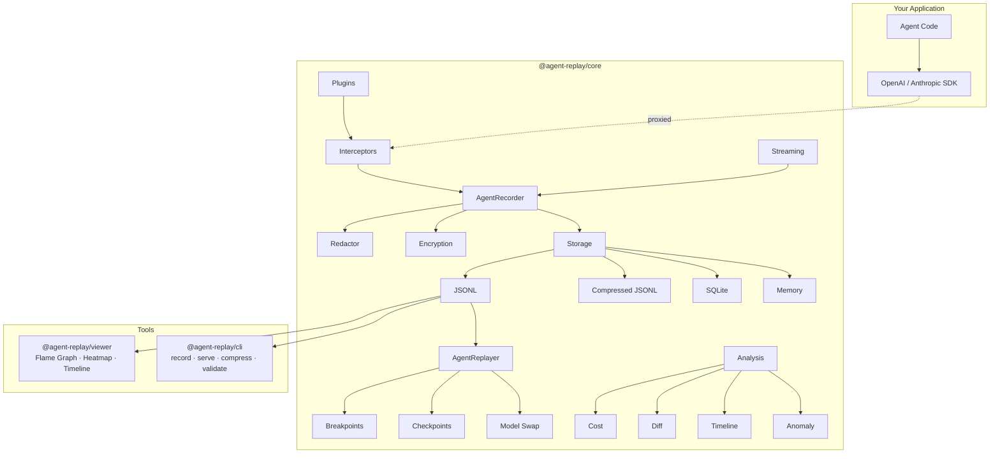

<div align="center">

```
    _                    _     ____            _
   / \   __ _  ___ _ __ | |_  |  _ \ ___ _ __ | | __ _ _   _
  / _ \ / _` |/ _ \ '_ \| __| | |_) / _ \ '_ \| |/ _` | | | |
 / ___ \ (_| |  __/ | | | |_  |  _ <  __/ |_) | | (_| | |_| |
/_/   \_\__, |\___|_| |_|\__| |_| \_\___| .__/|_|\__,_|\__, |
        |___/                            |_|            |___/
```

**Production-grade AI agent execution trace debugger**

[](https://www.npmjs.com/package/@agent-replay/core)
[](./LICENSE)
[](https://nodejs.org/)
[](https://www.typescriptlang.org/)
[](./packages/core/tests)
[](https://github.com/Zijian-Ni/agent-replay/actions)
[](https://bundlephobia.com/package/@agent-replay/core)

Record, replay, and debug every LLM call, tool invocation, and decision your AI agents make.
Zero-config. Local-first. No cloud account required.

<!-- TODO: Add animated demo GIF here -->
<!--  -->

[Getting Started](#quick-start) · [Viewer Demo](#viewer) · [CLI](#cli) · [Docs](./docs/) · [Changelog](./CHANGELOG.md)

</div>

---

## Why Agent Replay?

When your AI agent makes **47 LLM calls**, invokes **12 tools**, and costs **$0.83 per run** — you need visibility.

**The problems:**
- Your agent silently burns tokens on redundant LLM calls, but you can't see which ones
- A tool call fails deep in a chain, and you have no idea what happened 3 steps before it
- You optimized a prompt, but did it actually reduce cost? You can't compare runs
- Your agent works in dev but fails in prod — with no trace to debug
- You need to audit what your agent did, but there's no record

**Agent Replay gives you:**
- Full execution trace of every LLM call, tool invocation, and decision
- Step-through replay with time travel, breakpoints, and speed control
- Cost analysis and anomaly detection to find optimization opportunities
- A visual debugger with flame graphs, heatmaps, and timeline views
- Automatic PII redaction and encryption for production safety

## Features

| | Feature | Description |
|---|---|---|
| **Record** | Zero-config capture | Proxy-based interception for OpenAI & Anthropic SDKs. Streaming support. One line to start. |
| **Replay** | Time-travel debugging | Step-through with breakpoints, speed control, model swapping, checkpoint save/restore. |
| **Analyze** | Cost & anomaly detection | Per-model cost breakdown, token spike detection, error patterns, trace diffing. |
| **View** | Visual debugger | Flame graph, token heatmap, timeline view, minimap, dark/light themes. Export as HTML. |
| **Plugin** | Extensible | Plugin system for LangChain, CrewAI, and custom frameworks. |
| **Compress** | Space efficient | gzip compression reduces trace files by ~80%. Auto-detect on load. |
| **Secure** | Privacy by default | Auto-redaction of API keys, emails, SSNs, credit cards. AES-256-GCM encryption at rest. |
| **Store** | Flexible backends | JSONL (plain or compressed), SQLite, or in-memory. Bring your own storage. |

## Quick Start

```bash
pnpm add @agent-replay/core
```

### Record an OpenAI agent

```typescript
import { AgentRecorder, interceptOpenAI } from '@agent-replay/core';
import OpenAI from 'openai';

const recorder = new AgentRecorder({ name: 'my-agent', storage: 'file' });
const openai = interceptOpenAI(new OpenAI(), recorder);

// Use openai as normal — every call is recorded automatically
const response = await openai.chat.completions.create({
  model: 'gpt-4o',
  messages: [{ role: 'user', content: 'Explain quantum computing in one sentence.' }],
});

const trace = await recorder.stop();
console.log(`Recorded ${trace.summary!.totalSteps} steps, cost: $${trace.summary!.totalCost.toFixed(4)}`);
```

### Record streaming responses

```typescript
import { AgentRecorder, interceptOpenAIStream } from '@agent-replay/core';
import OpenAI from 'openai';

const recorder = new AgentRecorder({ name: 'streaming-agent', storage: 'file' });
const openai = interceptOpenAIStream(new OpenAI(), recorder);

const stream = await openai.chat.completions.create({
  model: 'gpt-4o',
  messages: [{ role: 'user', content: 'Write a haiku' }],
  stream: true,
});

for await (const chunk of stream) {
  process.stdout.write(chunk.choices[0]?.delta?.content ?? '');
}

await recorder.stop(); // Stream chunks are recorded with timing
```

### Record Anthropic agents

```typescript
import { AgentRecorder, interceptAnthropic } from '@agent-replay/core';
import Anthropic from '@anthropic-ai/sdk';

const recorder = new AgentRecorder({ name: 'claude-agent', storage: 'file' });
const anthropic = interceptAnthropic(new Anthropic(), recorder);

const message = await anthropic.messages.create({
  model: 'claude-sonnet-4-20250514',
  max_tokens: 1024,
  messages: [{ role: 'user', content: 'What is the meaning of life?' }],
});

await recorder.stop();
```

### Use plugins (LangChain, CrewAI)

```typescript
import { AgentRecorder, PluginRegistry, langchainPlugin } from '@agent-replay/core';

const registry = new PluginRegistry();
registry.register(langchainPlugin);

const recorder = new AgentRecorder({ name: 'langchain-agent' });
registry.attach(recorder);

// Wrap your LangChain chain
const chain = registry.createInterceptor('langchain', myChain, recorder);
const result = await chain.invoke('my input');
```

### Replay with breakpoints and speed control

```typescript
import { AgentReplayer, JsonlStorage } from '@agent-replay/core';

const storage = new JsonlStorage('./traces');
const data = await storage.load('trace-id');
const replayer = new AgentReplayer(data!, {
  speed: 2, // 2x speed
  breakpoints: [
    { type: 'cost', costThreshold: 0.50 },  // Stop when cost exceeds $0.50
    { type: 'error' },                        // Stop on any error
    { type: 'tool', toolName: 'web_search' }, // Stop when web_search is called
  ],
  modelSubstitutions: { 'gpt-4': 'gpt-3.5-turbo' }, // Swap models for cost comparison
  onBreakpoint: (bp, step) => console.log(`Breakpoint hit: ${bp.type} at ${step.name}`),
});

replayer.saveCheckpoint('start');
const steps = await replayer.replayAll();

// If paused at breakpoint, resume
if (replayer.isPaused) {
  await replayer.resume();
}
```

### Analyze costs and detect anomalies

```typescript
import { analyzeCost, detectAnomalies } from '@agent-replay/core';

const costs = analyzeCost(trace);
console.log(`Total: $${costs.total.toFixed(4)}`);
for (const [model, data] of Object.entries(costs.byModel)) {
  console.log(`  ${model}: ${data.calls} calls, $${data.cost.toFixed(4)}`);
}

const anomalies = detectAnomalies(trace);
anomalies.forEach(a => console.log(`[${a.severity}] ${a.message}`));
```

### Compress traces (~80% savings)

```typescript
import { CompressedJsonlStorage, compressDirectory } from '@agent-replay/core';

// Use compressed storage backend
const storage = new CompressedJsonlStorage('./traces', true);
await storage.save(serializedTrace); // Saves as .jsonl.gz

// Or batch compress existing files
const result = await compressDirectory('./traces');
console.log(`Compressed ${result.compressed.length} files, saved ${result.savedBytes} bytes`);
```

## Architecture



## Packages

| Package | Description | Version |
|---------|-------------|---------|
| [`@agent-replay/core`](./packages/core) | Recording, replay, analysis, plugins, compression, security | `0.2.0` |
| [`@agent-replay/viewer`](./packages/viewer) | Web viewer with flame graph, heatmap, timeline, dark/light themes | `0.2.0` |
| [`@agent-replay/cli`](./packages/cli) | CLI: record, serve, view, diff, stats, compress, validate, merge, export | `0.2.0` |

## Viewer

The web viewer provides three visualization modes:

- **Timeline** — Step-by-step cards with duration bars, color-coded by type
- **Flame Graph** — Chrome DevTools-style timing visualization
- **Heatmap** — Token usage intensity map (cool blue → hot red)

Plus: minimap navigation, keyboard shortcuts (press `?`), dark/light themes, export as shareable HTML.

## CLI

```bash
# Record an agent session
agent-replay record -- node my-agent.js

# Serve the viewer with live API
agent-replay serve --port 3000 --dir ./traces

# View traces in terminal
agent-replay view ./traces/

# Compare two trace runs
agent-replay diff trace-a.jsonl trace-b.jsonl

# Show cost and token statistics
agent-replay stats ./traces/

# Compress trace files (~80% disk savings)
agent-replay compress ./traces/

# Validate trace file schema
agent-replay validate trace.jsonl

# Merge multiple traces into one
agent-replay merge trace1.jsonl trace2.jsonl -o merged.jsonl

# Export trace to standalone HTML
agent-replay export trace.jsonl --format html
```

## Comparison

| Feature | Agent Replay | Langfuse | LangSmith | Phoenix |
|---------|:---:|:---:|:---:|:---:|
| Open source | Yes | Partial | No | Yes |
| Self-hosted / local-first | Yes | Yes | No | Yes |
| No cloud account required | **Yes** | No | No | No |
| Works offline | **Yes** | No | No | No |
| SDK-level recording | Yes | Yes | Yes | Yes |
| **Streaming support** | **Yes** | Yes | Yes | Yes |
| **Plugin system** | **Yes** | No | No | No |
| Automatic PII redaction | **Yes** | No | No | No |
| Encryption at rest (AES-256-GCM) | **Yes** | No | No | No |
| **Trace replay / time-travel** | **Yes** | No | No | No |
| **Conditional breakpoints** | **Yes** | No | No | No |
| **Model substitution in replay** | **Yes** | No | No | No |
| Trace diffing | **Yes** | No | No | No |
| **Flame graph visualization** | **Yes** | No | No | No |
| **Token heatmap** | **Yes** | No | No | No |
| **Trace compression (gzip)** | **Yes** | No | No | No |
| **Export as shareable HTML** | **Yes** | No | No | No |
| Built-in web viewer | Yes | Yes | Yes | Yes |
| CLI tool | Yes | No | Yes | No |
| Cost analysis | Yes | Yes | Yes | Yes |
| Anomaly detection | **Yes** | No | No | No |
| Zero config | **Yes** | No | No | No |
| Free forever | **Yes** | Freemium | Freemium | Yes |

## Performance

| Operation | Metric |
|-----------|--------|
| Record overhead per step | < 0.5ms |
| Replay 1000 steps (instant) | < 50ms |
| Compress 10MB trace | ~200ms (~80% reduction) |
| Load compressed trace | ~100ms |
| Memory per 1000 steps | ~2MB |

## Examples

- [`openai-chat`](./examples/openai-chat) — Record OpenAI chat completions
- [`anthropic-agent`](./examples/anthropic-agent) — Record Anthropic agent with tool use
- [`custom-agent`](./examples/custom-agent) — Manual recording with custom tools

## Documentation

- [Getting Started](./docs/getting-started.md)
- [Architecture](./docs/architecture.md)
- [API Reference](./docs/api-reference.md)
- [Interceptors](./docs/interceptors.md)
- [Security](./docs/security.md)
- [Viewer](./docs/viewer.md)

## Roadmap

- [ ] Real-time recording mode via WebSocket (watch agent execute live)
- [ ] Trace comparison overlay (superimpose two traces on same timeline)
- [ ] Worker thread for embedding computation
- [ ] VS Code extension for in-editor trace viewing
- [ ] OpenTelemetry export support
- [ ] Shared trace URLs (signed, expiring links)
- [ ] Cost optimization suggestions (auto-detect where cheaper models would suffice)

## Development

```bash
git clone https://github.com/Zijian-Ni/agent-replay.git
cd agent-replay
pnpm install
pnpm build
pnpm test      # 150+ tests
pnpm lint
```

## Contributing

Contributions welcome! See [CONTRIBUTING.md](./CONTRIBUTING.md) for guidelines.

## License

[PolyForm Shield License 1.0.0](./LICENSE) — Copyright (c) 2026 Zijian Ni (倪子健)

## Built With

[TypeScript](https://www.typescriptlang.org/) ·
[Vite](https://vitejs.dev/) ·
[Vitest](https://vitest.dev/) ·
[tsup](https://tsup.egoist.dev/) ·
[Turborepo](https://turbo.build/)
