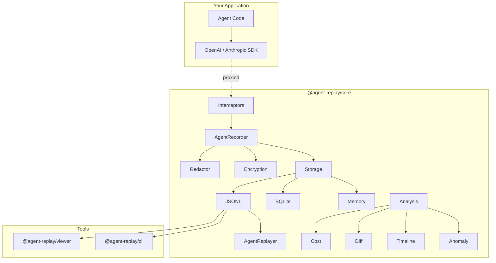

<div align="center">

# Agent Replay

**Production-grade AI agent execution trace debugger**

[](https://www.npmjs.com/package/@agent-replay/core)
[](./LICENSE)
[](https://nodejs.org/)
[](https://www.typescriptlang.org/)
[](./packages/core/tests)
[](https://github.com/Zijian-Ni/agent-replay/actions)

Record, replay, and debug every LLM call, tool invocation, and decision your AI agents make.
Zero-config. Local-first. No cloud account required.

</div>

---

## Why Agent Replay?

When your AI agent makes 47 LLM calls, invokes 12 tools, and costs $0.83 per run -- you need visibility. Agent Replay captures the full execution trace and gives you the tools to understand, debug, and optimize it.

## Features

| | Feature | Description |
|---|---|---|
| **Record** | Zero-config capture | Proxy-based interception for OpenAI & Anthropic SDKs. One line to start recording. |
| **Replay** | Step-through debugging | Navigate traces step-by-step, seek to any point, fork and modify. |
| **Analyze** | Cost & anomaly detection | Per-model cost breakdown, token spike detection, error pattern analysis, trace diffing. |
| **View** | Dark-mode web viewer | Timeline visualization with color-coded cards, JSON inspector, keyboard navigation. |
| **Secure** | Privacy by default | Auto-redaction of API keys, emails, SSNs, credit cards. AES-256-GCM encryption at rest. |
| **Store** | Flexible backends | JSONL files, SQLite, or in-memory. Bring your own storage. |

## Quick Start

```bash
pnpm add @agent-replay/core
```

### Record an OpenAI agent

```typescript
import { AgentRecorder, interceptOpenAI, JsonlStorage } from '@agent-replay/core';
import OpenAI from 'openai';

const recorder = new AgentRecorder({ name: 'my-agent', storage: 'file' });
const openai = interceptOpenAI(new OpenAI(), recorder);

// Use openai as normal — every call is recorded automatically
const response = await openai.chat.completions.create({
  model: 'gpt-4o',
  messages: [{ role: 'user', content: 'Explain quantum computing in one sentence.' }],
});

const trace = await recorder.stop();
console.log(`Recorded ${trace.summary!.totalSteps} steps, cost: $${trace.summary!.totalCost.toFixed(4)}`);
```

### Replay a trace

```typescript
import { AgentReplayer, JsonlStorage } from '@agent-replay/core';

const storage = new JsonlStorage('./traces');
const data = await storage.load('trace-id');
const replayer = new AgentReplayer(data!);

while (replayer.hasNext()) {
  const step = await replayer.next();
  console.log(`[${step!.type}] ${step!.name} — ${step!.duration}ms`);
}
```

### Analyze costs

```typescript
import { analyzeCost, detectAnomalies } from '@agent-replay/core';

const costs = analyzeCost(trace);
console.log(`Total: $${costs.total.toFixed(4)}`);
for (const [model, data] of Object.entries(costs.byModel)) {
  console.log(`  ${model}: ${data.calls} calls, $${data.cost.toFixed(4)}`);
}

const anomalies = detectAnomalies(trace);
anomalies.forEach(a => console.log(`[${a.severity}] ${a.message}`));
```

## Architecture



## Packages

| Package | Description | Version |
|---------|-------------|---------|
| [`@agent-replay/core`](./packages/core) | Recording, replay, analysis, storage, security | `0.1.0` |
| [`@agent-replay/viewer`](./packages/viewer) | Web-based trace viewer with dark mode | `0.1.0` |
| [`@agent-replay/cli`](./packages/cli) | CLI for record, view, diff, stats, export | `0.1.0` |

## CLI

```bash
# Record an agent session
agent-replay record -- node my-agent.js

# View traces in terminal
agent-replay view ./traces/

# Compare two trace runs
agent-replay diff trace-a.jsonl trace-b.jsonl

# Show cost and token statistics
agent-replay stats ./traces/

# Export trace to standalone HTML
agent-replay export trace.jsonl --format html
```

## Comparison

| Feature | Agent Replay | Langfuse | LangSmith | Braintrust |
|---------|:---:|:---:|:---:|:---:|
| Open source | Yes | Partial | No | No |
| Self-hosted / local-first | Yes | Yes | No | No |
| No cloud account required | Yes | No | No | No |
| Works offline | Yes | No | No | No |
| SDK-level recording | Yes | Yes | Yes | Yes |
| Automatic PII redaction | Yes | No | No | No |
| Encryption at rest (AES-256-GCM) | Yes | No | No | No |
| Trace diffing | Yes | No | No | No |
| Built-in web viewer | Yes | Yes | Yes | Yes |
| CLI tool | Yes | No | Yes | No |
| Cost analysis | Yes | Yes | Yes | Yes |
| Anomaly detection | Yes | No | No | No |
| Zero config | Yes | No | No | No |
| Free forever | Yes | Freemium | Freemium | Freemium |

## Examples

- [`openai-chat`](./examples/openai-chat) — Record OpenAI chat completions
- [`anthropic-agent`](./examples/anthropic-agent) — Record Anthropic agent with tool use
- [`custom-agent`](./examples/custom-agent) — Manual recording with custom tools

## Documentation

- [Getting Started](./docs/getting-started.md)
- [Architecture](./docs/architecture.md)
- [API Reference](./docs/api-reference.md)
- [Interceptors](./docs/interceptors.md)
- [Security](./docs/security.md)
- [Viewer](./docs/viewer.md)

## Development

```bash
git clone https://github.com/Zijian-Ni/agent-replay.git
cd agent-replay
pnpm install
pnpm build
pnpm test
```

## Contributing

Contributions welcome! See [CONTRIBUTING.md](./CONTRIBUTING.md) for guidelines.

## License

[PolyForm Shield License 1.0.0](./LICENSE) — Copyright (c) 2026 Zijian Ni

## Built With

[TypeScript](https://www.typescriptlang.org/) ·
[Vite](https://vitejs.dev/) ·
[Vitest](https://vitest.dev/) ·
[tsup](https://tsup.egoist.dev/) ·
[Turborepo](https://turbo.build/)
