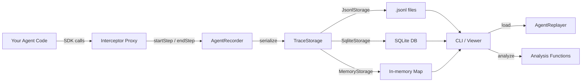

# Architecture

This document describes the high-level architecture of Agent Replay, the data flow through the system, and the key extension points.

## System Overview

Agent Replay is organized as a monorepo with three packages:

| Package | Description |
|---------|-------------|
| `@agent-replay/core` | Recording, replaying, storage, analysis, interceptors, and security |
| `@agent-replay/cli` | Command-line interface for viewing, diffing, and replaying traces |
| `@agent-replay/viewer` | Web-based trace viewer built with Vite |

## Data Flow



### Recording Flow

1. Your agent code creates an `AgentRecorder` with a name and storage configuration.
2. SDK clients (OpenAI, Anthropic) are wrapped with interceptor functions (`interceptOpenAI`, `interceptAnthropic`). These create JavaScript `Proxy` objects that transparently capture every `.create()` call.
3. When an intercepted call is made, the proxy calls `recorder.startStep()` before the API call and `recorder.endStep()` after the response (or error) arrives. Token usage and cost are extracted automatically.
4. Custom operations can be recorded manually with `startStep()`/`endStep()` or `addStep()`, and custom functions can be wrapped with `interceptFunction()`.
5. When `recorder.stop()` is called, the trace is finalized with timing and summary statistics, serialized, and persisted to the configured storage backend.

### Replay Flow

1. A serialized trace is loaded from storage (JSONL file, SQLite, or memory).
2. An `AgentReplayer` is created from the trace. It flattens the step tree into a linear sequence for iteration.
3. Steps can be traversed one at a time with `next()`, jumped to with `seek()`, or played all at once with `replayAll()`.
4. The `fork()` method creates a copy of the replay state up to the current position, allowing what-if analysis with modified steps.

### Analysis Flow

Analysis functions operate on finalized `Trace` objects:

- `analyzeCost(trace)` — breaks down token usage and cost by model and step type.
- `detectAnomalies(trace, thresholds)` — flags slow steps, high costs, token spikes, high error rates, and repeated errors.
- `generateTimeline(trace)` — produces a flat list of `TimelineEntry` objects with offsets and depth for visualization.
- `diffTraces(traceA, traceB)` — compares two traces, listing added/removed/modified steps and summary deltas.

## Package Structure

```
packages/
  core/
    src/
      recorder.ts        # AgentRecorder class
      replayer.ts         # AgentReplayer class
      trace.ts            # Serialization/deserialization helpers
      types.ts            # All TypeScript type definitions
      interceptors/
        openai.ts         # interceptOpenAI — proxy for OpenAI SDK
        anthropic.ts      # interceptAnthropic — proxy for Anthropic SDK
        generic.ts        # interceptFunction — wrap any async function
      storage/
        index.ts          # createStorage factory
        jsonl.ts          # JsonlStorage — JSONL file backend
        memory.ts         # MemoryStorage — in-memory backend
        sqlite.ts         # SqliteStorage — SQLite backend
      analysis/
        cost.ts           # analyzeCost
        diff.ts           # diffTraces
        anomaly.ts        # detectAnomalies
        timeline.ts       # generateTimeline
      security/
        redactor.ts       # Redactor class — pattern-based PII removal
        encryption.ts     # AES-256-GCM encrypt/decrypt functions
  cli/
    src/
      commands/
        view.ts           # View trace summary
        replay.ts         # Replay a trace step-by-step
        diff.ts           # Compare two traces
        stats.ts          # Show trace statistics
        record.ts         # Record a new trace
  viewer/
    src/                  # Vite-based web application
```

## Trace Data Model

A **Trace** represents a single agent execution session:

```
Trace
  id: string (UUID)
  name: string
  startedAt: Date
  endedAt: Date
  duration: number (ms)
  steps: Step[]
  metadata: Record<string, unknown>
  summary: TraceSummary
```

A **Step** represents a single operation within a trace:

```
Step
  id: string (UUID)
  parentId?: string          # for nesting
  type: "llm_call" | "tool_call" | "tool_result" | "decision" | "error" | "custom"
  name: string
  startedAt: Date
  endedAt: Date
  duration: number (ms)
  input: unknown
  output: unknown
  tokens?: { prompt, completion, total }
  cost?: number (USD)
  model?: string
  error?: { message, stack, code }
  children: Step[]
  metadata?: Record<string, unknown>
```

Steps form a tree structure via `parentId` and `children`, allowing you to represent nested operations like "planning" containing "analyze-query" sub-steps.

## Storage Format

### JSONL (default)

Each trace is stored as a `.jsonl` file with three record types:

1. `trace_start` — trace metadata (without steps)
2. `step` — one line per top-level step (with nested children inline)
3. `trace_end` — trace ID and computed summary

This format supports streaming writes and partial reads.

### SQLite

Traces are stored in a single `traces` table with columns: `id`, `name`, `data` (JSON blob), and `created_at`. Requires the `better-sqlite3` peer dependency.

### Memory

An in-memory `Map<TraceId, SerializedTrace>` for testing and ephemeral use.

## Extension Points

### Custom Storage

Implement the `TraceStorage` interface:

```ts
interface TraceStorage {
  save(trace: SerializedTrace): Promise<void>;
  load(id: TraceId): Promise<SerializedTrace | null>;
  list(): Promise<TraceId[]>;
  delete(id: TraceId): Promise<void>;
  search(query: string): Promise<SerializedTrace[]>;
}
```

### Custom Interceptors

Use `interceptFunction` to wrap any async function, or build a custom proxy using `recorder.startStep()` and `recorder.endStep()`:

```ts
function interceptMySDK(client: MySDK, recorder: AgentRecorder): MySDK {
  return new Proxy(client, {
    get(target, prop, receiver) {
      // Intercept method calls, record steps, return results
    },
  });
}
```

### Custom Redaction Rules

Add patterns to the `Redactor`:

```ts
const recorder = new AgentRecorder({
  name: "my-trace",
  redact: true,
  redactPatterns: [/my-secret-pattern/gi],
});
```

Or use the `Redactor` class directly:

```ts
import { Redactor } from "@agent-replay/core";

const redactor = new Redactor();
redactor.addRule({
  name: "custom_id",
  pattern: /CUST-\d{6}/g,
  replacement: "[REDACTED_CUSTOMER_ID]",
});
```
